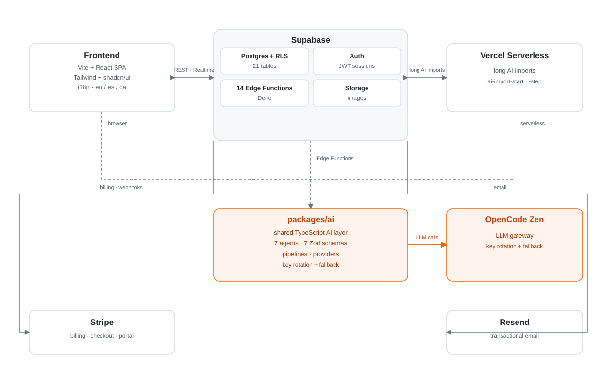

<div align="center">


# SaCarta

**The AI-native digital menu for restaurants. Build, translate and optimize your menu in minutes.**

[](https://sacarta.azpy.es)
[](https://vitejs.dev)
[](https://supabase.com)
[](https://github.com/anomalyco/opencode)

</div>

---

## The product

SaCarta is a SaaS platform that gives restaurants a **digital menu powered by AI**: upload your menu once, and SaCarta structures it, writes appetizing descriptions, translates it into your guests' languages, and keeps it optimized with data-driven recommendations — all from a QR code your customers scan at the table.

Born in Mallorca, built for the hospitality industry: restaurants, hotels, bars, beach clubs and coffee shops.

## The problem

Restaurant owners lose **hours every week** maintaining their menu:

- Manual updates, dish by dish, every time a plate changes.
- Static PDFs that are **never translated**, losing international guests.
- No visibility into what customers actually look at.
- No way to tell whether the menu is *performing* or just *existing*.

## The solution

SaCarta replaces the static menu with an AI employee that runs it for you:

1. **Upload** — import a menu from a PDF or image.
2. **Build** — AI structures categories, writes descriptions and prices your dishes.
3. **Translate** — the menu is translated automatically into every language you support.
4. **Optimize** — a restaurant health score, insights and recommendations show you exactly what to improve.
5. **Grow** — an AI copilot and customer assistant engage your guests directly.

Every feature is built on one shared AI layer (see below), one provider gateway, and a subscription that pays for itself.

## AI architecture

All AI functionality lives in a **single shared package** consumed by every surface of the app — the frontend (browser) and the backend (Supabase Edge Functions in Deno):

```
┌─────────────┐        ┌──────────────────────────────────────────┐        ┌──────────────┐
│  Frontend   │        │               packages/ai               │        │  AI gateway  │
│  Vite/React │───────▶│  agents · pipelines · tools · schemas   │───────▶│ OpenCode Zen │
│             │◀───────│  (Zod-validated, TypeScript, boundary)  │◀───────│  LLM API     │
└─────────────┘        └──────────────────────────────────────────┘        └──────────────┘
```

- **7 agents**: Description, Translation, Optimizer, Import, Copilot, Insights + Recommendations, Customer Assistant.
- **7 Zod schemas** validate every input/output at the boundary — invalid data never reaches the UI.
- **1 LLM provider**: OpenCode Zen with **key rotation** and a **fallback chain** (free → paid gateway) for zero-downtime generation.
- **Pipelines** (Optimizer, Insights, Import) combine deterministic business rules with AI for fast, cheap, explainable results.
- All generation is **audited**: jobs, credit consumption and menu scores are persisted to the database.

## Technical architecture



| Layer | What it does |
|---|---|
| **Frontend** | Vite + React + TypeScript SPA (shadcn/ui + Tailwind), i18n (en/es/ca). |
| **Supabase** | Postgres (21 tables, RLS enabled everywhere), Auth, Storage, and 14 Deno Edge Functions. |
| **Vercel serverless** | Two Node endpoints for long-running AI menu imports (up to 300 s), step-based. |
| **AI layer** | `packages/ai` — shared TypeScript used by both browser and Edge Functions. |
| **AI gateway** | OpenCode Zen (key rotation + fallback) as the single LLM provider. |
| **Payments** | Stripe billing (3 plans) with customer portal. |
| **Email** | Resend transactional email (welcome, contact). |

## Tech stack

| Technology | Used for |
|---|---|
| [React 18](https://react.dev) + [TypeScript](https://www.typescriptlang.org) | Frontend application |
| [Vite](https://vitejs.dev) | Build tooling |
| [Tailwind CSS](https://tailwindcss.com) + [shadcn/ui](https://ui.shadcn.com) | Design system |
| [Supabase](https://supabase.com) | Postgres, Auth, Storage, Edge Functions (Deno) |
| [Vercel](https://vercel.com) | Hosting + serverless functions |
| [OpenCode Zen](https://github.com/anomalyco/opencode) | LLM gateway (key rotation + fallback) |
| [Stripe](https://stripe.com) | Subscription billing |
| [Resend](https://resend.com) | Transactional email |
| [Zod](https://zod.dev) | Schema validation in the AI boundary |

## Project structure

```
menu-magic/
├── api/                        # Vercel serverless — long AI imports (Node)
│   ├── ai-import-start.ts
│   └── ai-import-step.ts
├── packages/
│   └── ai/                     # Shared AI layer (agents, pipelines, tools, schemas, providers)
├── supabase/
│   ├── migrations/             # 17 SQL migrations (RLS everywhere)
│   └── functions/              # 14 Deno Edge Functions (auth, billing, AI, email)
├── src/
│   ├── components/             # UI primitives + dashboard components
│   ├── contexts/               # Auth · Language · Subscription
│   ├── hooks/                  # Data + AI hooks
│   ├── integrations/supabase/  # Supabase client
│   ├── lib/                    # API clients, i18n, constants
│   ├── locales/                # en / es / ca translations
│   ├── pages/                  # Routes (landing, dashboard, public menu)
│   └── types/                  # Domain types
├── docs/                       # Design, audit and planning documents
└── index.html
```

## Local development

**Prerequisites**

- [Node.js](https://nodejs.org) ≥ 18 and npm (or [Bun](https://bun.sh))
- A [Supabase](https://supabase.com) project (or the [Supabase CLI](https://supabase.com/docs/guides/cli) for local)
- An OpenCode Zen API key (see [opencode](https://github.com/anomalyco/opencode))

**Steps**

```sh
# 1. Clone the repository
git clone https://github.com/feeerraaan/menu-magic.git
cd menu-magic

# 2. Install dependencies
npm install

# 3. Create your environment file
cp .env.example .env   # then fill in the values (see table below)

# 4. Start the development server
npm run dev
```

**Database**

```sh
# With the Supabase CLI (migrations live in supabase/migrations/)
supabase start
supabase db push
```

## Environment variables

| Variable | Required | Purpose |
|---|---|---|
| `VITE_SUPABASE_URL` | ✅ | Your Supabase project URL |
| `VITE_SUPABASE_PUBLISHABLE_KEY` | ✅ | Supabase anon/publishable key (frontend) |
| `VITE_AI_IMPORT_BACKEND` | ✅ | Import backend selector (`vercel` / `edge`) |
| `SUPABASE_URL` | ✅ | Backend Supabase URL |
| `SUPABASE_SERVICE_ROLE_KEY` | ✅ | Backend service-role key (server / Edge Functions only) |
| `SUPABASE_ANON_KEY` | ✅ | Anon key (Edge Functions) |
| `OPENCODE_ZEN_API_KEYS` | ✅ | Comma-separated OpenCode Zen keys (rotation) |
| `AI_MODEL_DEFAULT` | ✅ | Default LLM model id |
| `AI_MODEL_MENU_IMPORT` | Optional | Model override for menu imports |
| `AI_IMPORT_GO_BASE_URL` | Optional | Paid gateway base URL (fallback chain) |
| `AI_IMPORT_GO_KEY` | Optional | Paid gateway API key |
| `AI_IMPORT_GO_MODEL` | Optional | Paid gateway model id |
| `AI_IMPORT_GO_FALLBACK_MODEL` | Optional | Paid gateway fallback model |
| `RESEND_API_KEY` | Optional | Transactional email |
| `STRIPE_SECRET_KEY` | Optional | Stripe server key (billing) |

> Secrets (service-role key, AI keys, Stripe/Resend keys) must **never** be exposed in frontend code or committed. They only exist in serverless / Edge Function environments.

## Deployment

- **Frontend + serverless** → [Vercel](https://vercel.com): connect the repo, set the `VITE_*` env vars, deploy. The `vercel.json` rewrites all routes to `index.html` and grants the AI-import functions a 300 s budget.
- **Database + Edge Functions** → [Supabase](https://supabase.com): link the project, `supabase db push`, then `supabase functions deploy` (with `--env` secrets).
- **Billing** → configure Stripe webhooks and secrets in the Stripe dashboard; customer portal via `customer-portal` Edge Function.

## Live demo

**[sacarta.azpy.es](https://sacarta.azpy.es)** — scan a QR at a real table, watch the menu translate itself, and ask the AI copilot a question. Free tier included.

## Author

Built by [@feeerraaan](https://github.com/feeerraaan) — born in Mallorca, recién horneado. 🥧
